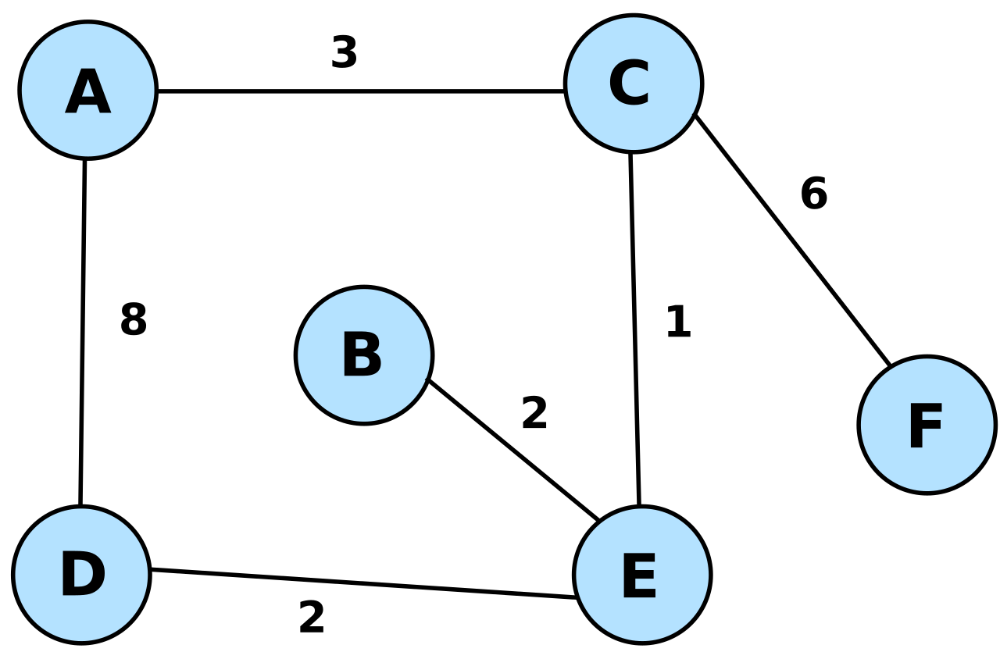

# OptiPath
OptiPath is a C# .NET library that provides functionality for finding the most optimal route on a map with nodes and edges.

main: 

## Give a Star! :star:

If you like or are using this project please give it a star. Thanks!




## Features
*Add nodes and edges to the map
*Find the fastest route between two nodes
*Customizable node and edge types by implementing the INode and IEdge<TNode> interfaces, respectively

<!-- ## Usage
To use XReflect in your project, follow these steps: -->

<!-- 1. Define your source and destination objects.
2. Configure the mapping rules using the XMapper fluent API.
3. Perform the object mapping using the Run method. -->

## Usage
1. To use the OptiPath library, follow these steps:
2. Define your node and edge types by implementing the INode and IEdge<TNode> interfaces, respectively. These interfaces provide the necessary properties and methods for the library to work correctly.
3. Create an instance of the Map<TNode, TEdge> class, where TNode and TEdge are your custom node and edge types.
4. Add nodes and edges to the map using the AddNode and AddEdge methods, respectively.
5. Use the FindFastestRoute method to find the fastest route between two nodes. Provide the start and end nodes as parameters, and the method will return a Route<TNode> object representing the fastest route.

Here's a simple example that demonstrates the usage of the OptiPath library:

```csharp

using OptiPath;

// Define custom node and edge types
public class Node : INode
{
    public string Name { get; }

    public Node(string name)
    {
        Name = name;
    }
}


public class Edge : IEdge<Node>
{
    public Node Source { get; }

    public Node Target { get; }

    private readonly int _weight = 0;

    public Edge(Node source, Node target, int weight)
    {
        Source = source;
        Target = target;
        _weight = weight;
    }

    public int GetWeight() => _weight;
}

class Program
{
    static void Main(string[] args)
    {
        // Create a map
        Map<Node, Edge> map = new Map<Node, Edge>();

        // Add nodes and edges to the map
        Node node1 = new Node("A");
        Node node2 = new Node("B");
        Node node3 = new Node("C");

        Edge edge1 = new Edge(node1, node2, 1);
        Edge edge2 = new Edge(node2, node3, 2);

        map.AddNode(node1);
        map.AddNode(node2);
        map.AddNode(node3);

        map.AddEdge(edge1);
        map.AddEdge(edge2);

        Route<Node> fastestRoute = map.FindFastestRoute(node1, node3);

        // Access route details
        Console.WriteLine($"Fastest route distance: {fastestRoute.Distance}"); // Equals 2
        Console.WriteLine($"Fastest route path: {string.Join(" -> ", fastestRoute.Path)}"); // A -> B -> C
    }
}

```
## Contributing
Contributions to OptiPath are welcome! If you find any issues or have suggestions for improvements, please create a new issue or submit a pull request.

## Authors

- **Travis Arndt**

## License

This project is licensed under the MIT License - [LICENSE.md](LICENSE)
